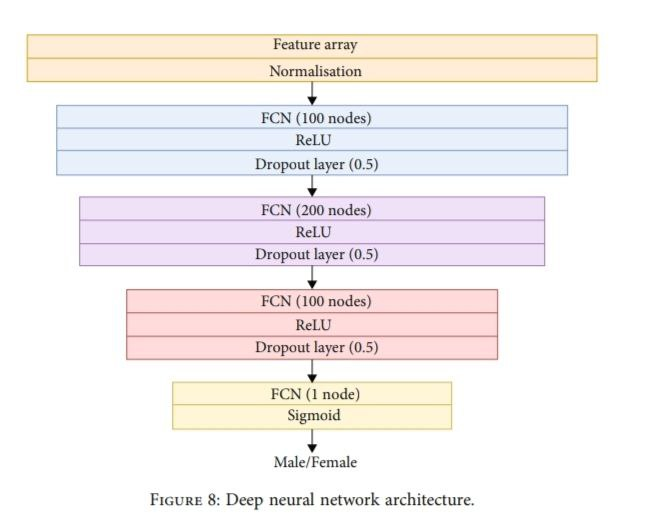

## Speaker Gender Recognition
- Speaker Gender Recognition (SGR) is a specialized field within speaker recognition that focuses on  
  identifying the gender of a speaker based on their voice . This task is essential in various applications, including:
    - Voice Assistants: Enhancing user experience by personalizing responses based on the user's gender.
    - Forensic Analysis: Assisting in criminal investigations where identifying the gender of a speaker can 
      provide valuable clues.
    - Telecommunications: Improving call routing and customer service by distinguishing between male and 
      female voices.
    - Entertainment and Media: Tailoring content and advertisements to specific demographic groups based on 
      gender.

 
